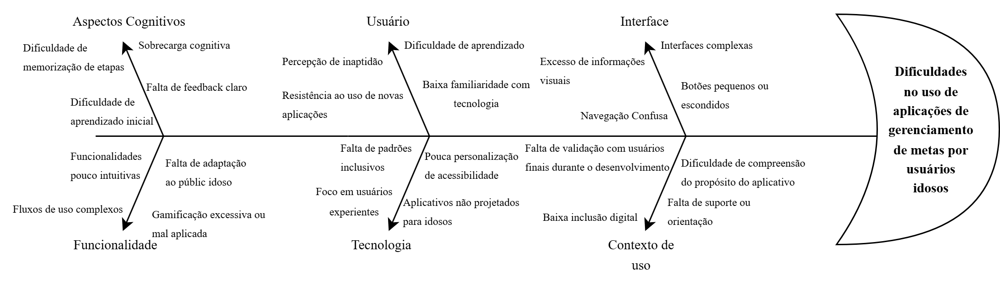
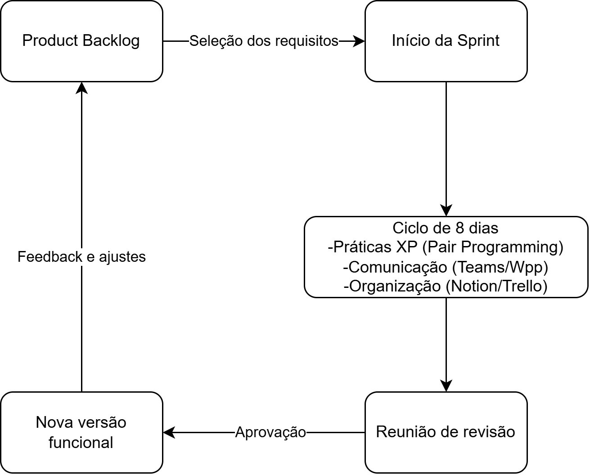

# HOPLIFE

## Visão do Produto e do Projeto

**Versão 1.0**

---

## Tabela - Integrantes do Grupo

| Matrícula | Nome | Função (responsabilidade) | Pontos de participação |
|---|---|---|---|
| 242028628 | Arthur Rezende Barreto | Scrum Master / Analista do Problema / Desenvolvedor Back-End | 29 |
| 222006570 | Arthur Souto Santos | Analista do Problema / Desenvolvedor Front-End | 0 |
| 241012131 | Davi Barbosa Alves | Product Owner / Desenvolvedor Front-End | 5 |
| 242015586 | Daniel Almeida Torquato | Analista de Qualidade / Desenvolvedor Back-End | 0 |
| 232002717 | Gabriela de Paula Nascimento | Product Owner / Desenvolvedora Front-End | 16 |
| 222006759 | Guilherme Augusto Rodrigues Sá | Analista de Qualidade / Desenvolvedor Back-End | 0 |
| 222008824 | Ithalo Ribeiro Dias | Analista do Problema / Desenvolvedor Front-End | 0 |
| 241011949 | Josué Xavier Carneiro | Analista de Qualidade / Desenvolvedor Back-End | 18 |
| 241012042 | Levi Evangelista Santos | Analista do Problema / Desenvolvedor Back-End | 16 |
| 232014511 | Maria Eduarda do Nascimento Vieira | Analista de Qualidade / Desenvolvedora Front-End | 0 |
| 232021928 | Maria Eduarda Rodrigues Morais | Product Owner / Desenvolvedora Front-End | 0 |
| 242005051 | Roberto de Oliveira Brito Filho | Scrum Master / Product Owner / Desenvolvedor Back-End | 16 |

> Pontos de participação dos membros da equipe.  
> Devem fechar 100 pontos para toda a equipe.

---

## Histórico de Revisões

| Data | Versão | Descrição | Autor(es) |
|---|---|---|---|
| | | | |

---

## Sumário

1. Visão Geral do Produto  
   1.1 Problema  
   1.2 Declaração de Posição do Produto  
   1.3 Objetivos do Produto  
   1.4 Tecnologias a Serem Utilizadas  
2. Visão Geral do Projeto  
   2.1 Ciclo de vida do projeto de desenvolvimento de software  
   2.2 Organização do Projeto  
   2.3 Planejamento das Fases e/ou Iterações do Projeto  
      2.3.1 Definições dos Entregáveis (Aliases)  
   2.4 Matriz de Comunicação  
   2.5 Gerenciamento de Riscos  
   2.6 Critérios de Replanejamento  
3. Processo de Desenvolvimento de Software  
4. Declaração de Escopo do Projeto  
   4.1 Backlog do produto  
   4.2 Perfis  
   4.3 Cenários  
   4.4 Tabela de Backlog do produto  
5. Métricas e Medições  
   5.1 GQM de medições  
6. Testes de Software  
   6.1 Estratégia de testes  
   6.2 Roteiro de teste  
7. Referências Bibliográficas  

---

## 1 Visão Geral do Produto

### 1.1 Problema

As aplicações digitais têm se tornado cada vez mais presentes no cotidiano desde a popularização dos computadores pessoais, intensificada a partir dos anos 2000. Nesse cenário, observa-se a existência de uma grande quantidade de sistemas voltados a diferentes finalidades. No entanto, uma parcela reduzida dessas aplicações é direcionada ao desenvolvimento pessoal e ao acompanhamento de metas.

Além disso, dentro desse grupo já limitado, há ainda menos soluções que consideram aspectos de acessibilidade para usuários com idade superior a 60 anos e com baixa familiaridade com tecnologia. Como consequência, muitos desses sistemas não atendem adequadamente às necessidades desse público, apresentando interfaces complexas, excesso de informações visuais e dificuldades de navegação.

Dessa forma, identifica-se a necessidade de soluções que não apenas realizem o gerenciamento de metas, mas que também sejam intuitivas, acessíveis e utilizem elementos de gamificação de forma equilibrada, sem sobrecarregar o usuário.

Essa necessidade é reforçada por estudos sobre inclusão digital na terceira idade, que evidenciam que fatores como vulnerabilidade, medo de uso e percepção de inaptidão atuam como barreiras significativas à adoção de tecnologias, enquanto aspectos como otimismo e percepção de necessidade favorecem essa adoção (FARIAS et al., 2015).

Diante desse cenário, o problema identificado consiste na ausência de aplicações de gerenciamento de metas que sejam adequadas às necessidades de usuários idosos, especialmente aqueles com baixa familiaridade tecnológica, o que limita sua inclusão digital e dificulta o uso de ferramentas que poderiam contribuir para sua organização pessoal e qualidade de vida.

Como forma de mitigar esse problema, propõe-se o desenvolvimento de um software de gerenciamento de metas voltado ao público idoso, com foco em acessibilidade e usabilidade. A solução deverá apresentar uma interface simplificada, com navegação intuitiva, redução de elementos visuais excessivos e utilização moderada de técnicas de gamificação, de modo a incentivar o engajamento sem gerar sobrecarga cognitiva. Com o objetivo de sintetizar as principais causas relacionadas ao problema identificado, foi elaborado um Diagrama de Ishikawa. A ferramenta permite visualizar, de forma estruturada, os fatores que contribuem para as dificuldades enfrentadas por usuários idosos no uso de aplicações de gerenciamento de metas.

A Figura 1 apresenta o diagrama com as principais categorias de análise.

#### Figura 1 – Diagrama de Ishikawa

> Fonte: Elaboração própria

---

### 1.2 Declaração de Posição do Produto

Para pessoas com idade avançada e/ou com baixa familiaridade tecnológica, que necessitam organizar suas tarefas periódicas ou metas determinadas de forma simples, este software é uma aplicação web de gerenciamento de tarefas gamificada que oferece interface acessível, intuitiva e motivadora, ao contrário de aplicativos tradicionais que são complexos e pouco acessíveis. Nosso produto prioriza simplicidade, acessibilidade e engajamento progressivo.

O produto proposto busca atender a uma lacuna identificada no mercado de aplicações de gerenciamento de tarefas, especialmente no que se refere à acessibilidade para usuários idosos. Diferentemente de soluções convencionais, que frequentemente apresentam interfaces densas e pouco intuitivas, o sistema prioriza a redução da carga cognitiva e poluição visual e a clareza das interações. Além disso, a utilização de elementos de gamificação ocorre de maneira controlada e adaptada ao público-alvo, com o objetivo de incentivar o uso frequente e contínuo sem gerar confusão ou sobrecarga. Dessa forma, o produto se posiciona como uma ferramenta inclusiva, voltada não apenas à organização pessoal, mas também à promoção da autonomia digital.

#### Tabela 1 - Posição do produto no mercado

| Cláusula | Definição |
|---|---|
| **Para:** | Usuários buscando organização pessoal (em especial, pessoas idosas e/ou com dificuldades, para inclusão digital) |
| **Necessidade:** | Organização pessoal e inclusão digital |
| **O (nome do produto):** | Hoplife - Aplicação web de Gerenciamento de metas e vida pessoal |
| **Que:** | possui uma interface limpa e organizada onde as funções podem ser executadas de forma intuitiva e com poucos comandos. |
| **Ao contrário:** | de outras opções que não tem foco em acessibilidade e podem se demonstrar complexas demais e pouco engajantes. |
| **Nosso produto:** | visa ser acessível e estimulante para todos os usuários tirarem o melhor proveito desse através de gestão de metas pessoais e um sistema engajante que propõe sentimento de satisfação e recompensa, ao mesmo tempo que integra usuários não muito acostumados ao ambiente digital. |

---

### 1.3 Objetivos do Produto

O projeto visa desenvolver uma aplicação web de gerenciamento de tarefas e metas com foco em acessibilidade e usabilidade, voltada em ser intuitiva para usuários com 60 anos ou mais, promovendo organização pessoal, engajamento e inclusão digital. Objetivos específicos incluem:

* Desenvolver uma interface acessível, com alto contraste, tipografia adequada e elementos visuais de fácil identificação;
* Garantir uma navegação simples e intuitiva, com redução do número de etapas (ou cliques) necessárias para execução das principais ações;
* Implementar funcionalidades básicas de gerenciamento de tarefas, como criação, edição, visualização e conclusão de metas periódicas ou determinadas;
* Incorporar elementos de gamificação de forma moderada, visando incentivar o uso contínuo sem comprometer a clareza da interface;
* Reduzir a carga cognitiva do usuário por meio de organização visual simplificada e feedbacks claros;
* Validar continuamente a usabilidade do sistema ao longo do desenvolvimento, por meio de testes e revisões iterativas;
* Promover a inclusão digital do público idoso, facilitando o uso de tecnologias no cotidiano.

---

### 1.4 Tecnologias a Serem Utilizadas

O projeto utilizará uma arquitetura tecnológica selecionada para garantir robustez, segurança e alta acessibilidade, fatores críticos para o público-alvo da aplicação. A pilha de tecnologias (tech stack) abrange linguagens, frameworks, ferramentas de qualidade e ambientes conteinerizados, descritos a seguir:

* **Linguagem de Programação e Back-end:** A linguagem principal adotada para a lógica de negócios e estruturação do servidor será Python, utilizando o framework Django. Esta escolha visa acelerar o desenvolvimento de uma base sólida e facilitar a comunicação direta e otimizada com o banco de dados;
* **Front-end e Responsividade:** Para a interface com o usuário, serão utilizados HTML, CSS e JavaScript, integrados ao framework Bootstrap. O uso do Bootstrap garante que a aplicação seja responsiva (adaptável a telas de dispositivos móveis) e permite a implementação nativa de componentes de acessibilidade visual, como botões de grande proporção e esquemas de alto contraste;
* **Banco de Dados:** O armazenamento e a persistência das informações serão gerenciados pelo SQLite. Por ser um banco de dados relacional leve e embutido no ambiente Python, ele elimina a necessidade de configuração de infraestruturas complexas de servidores, atendendo perfeitamente aos requisitos de concorrência e volume de dados previstos para o escopo desta entrega. O acesso e a manipulação dos dados serão abstraídos por meio de um mapeamento objeto-relacional (ORM), facilitando o desenvolvimento da equipe sem exigir a escrita de consultas SQL manuais;
* **Segurança e Autenticação (IAM):** O gerenciamento de identidades e acessos será feito por meio do Keycloak. Esta ferramenta será responsável por garantir a criptografia de dados sensíveis e gerenciar protocolos de segurança avançados, oferecendo uma camada extra de proteção e confiabilidade contra fraudes e acessos indevidos;
* **Qualidade e Inspeção de Código:** O SonarQube será integrado ao repositório para realizar a análise estática contínua do código-fonte. A ferramenta automatizará a detecção de code smells, rastreamento de débito técnico e a prevenção de vulnerabilidades de segurança;
* **Ambiente, Versionamento e Ferramentas:** O ambiente de desenvolvimento integrado (IDE) padronizado pela equipe será o Visual Studio Code (VS Code). O controle de versão e a hospedagem do código ocorrerão via Git e GitHub. Adicionalmente, o Docker será empregado para a conteinerização dos serviços (como o Keycloak e o SonarQube), facilitando a padronização do ambiente de execução entre os membros da equipe.

Detalhaments posteriores e especificações técnicas de infraestrutura poderão ser necessários ao longo do tempo. Eles serão o alvo do documento de arquitetura do software, que descreverá de forma aprofundada como essas tecnologias serão aplicadas e integradas no desenvolvimento da solução.

---

## 2 Visão Geral do Projeto

### 2.1 Ciclo de vida do projeto de desenvolvimento de software

A definição do ciclo de vida deste projeto busca um equilíbrio entre a organização necessária para um trabalho acadêmico e a flexibilidade para criar um aplicativo voltado ao público idoso. A seguir, detalhamos como esse modelo vai funcionar na prática:

* **Metodologia (abordagem filosófica):** Vamos utilizar a Metodologia Ágil. Como nosso objetivo central é a acessibilidade para pessoas com baixa familiaridade tecnológica, o desenvolvimento precisa ser adaptável. O modelo ágil nos permite evoluir o software com base nos feedbacks reais dos usuários, evitando gastar tempo em funcionalidades que possam gerar sobrecarga visual ou confusão;
* **Processo (conjunto de atividades):** Trabalharemos com uma abordagem híbrida, unindo Scrum e Extreme Programming (XP). O Scrum será usado para organizar a gestão do projeto e nosso backlog de metas e gamificação. Já o XP entra para garantir a qualidade técnica, ajudando a equipe a produzir um código limpo, robusto e fácil de manter;
* **Procedimentos (guia o modo de fazer):** Nosso trabalho será dividido em Sprints de 8 dias, acompanhadas de reuniões periódicas para monitorar o progresso e possíveis riscos. Também vamos adotar a Programação em Pares (Pair Programming) para diminuir a chance de erros lógicos e manter um padrão de qualidade no código feito por diferentes membros da equipe;
* **Métodos (técnica formal):** Para define o que o sistema precisa ter, usaremos Histórias de Usuário (User Stories), entrevistas e sessões de brainstorming. Isso é essencial para transformar as dificuldades dos idosos em soluções técnicas. Nosso esquema de priorização garante que os requisitos obrigatórios (MUST), como botões grandes e navegação simples, sejam entregues logo na primeira versão funcional (MVP);
* **Ferramentas (instrumentos de apoio):** Para a gestão e o desenvolvimento, usaremos o Trello para controlar o fluxo de tarefas e o Notion para centralizar toda a documentação. Na comunicação, o WhatsApp será usado para o alinhamento rápido do dia a dia da equipe, enquanto o Microsoft Teams será o nosso canal oficial para as reuniões formais e ritos do Scrum.

---

### 2.2 Organização do Projeto

A tabela a seguir apresenta a organização das responsabilidades entre os membros da equipe. O objetivo desta estruturação é direcionar o fluxo de trabalho e garantir que todas as etapas necessárias para o desenvolvimento do software tenham responsáveis claros. Ressalta-se que esta divisão não estabelece qualquer relação de hierarquia ou subordinação: todos os integrantes são igualmente importantes e corresponsáveis pelo sucesso do projeto.

#### Tabela 2 - Divisão de atribuições e responsabilidades

| Papel | Atribuições | Responsável | Participantes |
|---|---|---|---|
| **Scrum Master** | Garantir a aplicação do framework ágil, remover impedimentos, facilitar as cerimônias e promover a comunicação fluida entre todas as frentes de trabalho. | Integrantes AR e R | Arthur Rezende, Roberto Filho |
| **Product Owner** | Levantar os requisitos, criar e priorizar o Backlog, além de validar as entregas junto ao cliente. | Integrantes R, DB, P e MR | Roberto Filho, Davi Barbosa, Gabriela de Paula, Maria Eduarda Rodrigues |
| **Analista do Problema** | Analisar o problema do usuário (público idoso) | Integrantes AR, AS, L e I | Arthur Rezende, Arthur Souto, Levi Evangelista e Ithalo Ribeiro |
| **Analista de Qualidade** | Executar os Casos de Teste (CTs), garantir o cumprimento do Definition of Done, configurar o Docker e realizar inspeções de código via SonarQube. | Integrantes G, MN, J e DT | Guilherme Rodrigues, Maria Eduarda do Nascimento, Josué Xavier, Daniel Torquato |
| **Desenvolvedor Front-End** | Codificar a interface visual (HTML/CSS/Bootstrap), garantindo a responsividade e a aplicação de todos os requisitos de acessibilidade visual. | Integrantes AS, G, I, MN, MR e DB | Arthur Souto, Guilherme Rodrigues, Ithalo Ribeiro, Maria Eduarda do Nascimento, Maria Eduarda Rodrigues e Davi Barbosa |
| **Desenvolvedor Back-End** | Estruturar o banco de dados, implementar a lógica de negócios em Python (Django), integrar a segurança e fornecer os dados para a interface. | Integrantes AR, R, DT, L, P e J | Arthur Rezende, Roberto Filho, Daniel Torquato, Levi Evangelista Santos, Gabriela de Paula e Josué Xavier |
| **Cliente** | Fornecer feedback contínuo sobre a usabilidade, validar as telas e garantir que o produto atende às necessidades reais do público-alvo. | Stakeholders | Voluntários idosos |

---

### 2.3 Planejamento das Fases e/ou Iterações do Projeto

A tabela a seguir apresenta o ciclo de vida do projeto, estruturado em iterações curtas (sprints) para garantir o desenvolvimento contínuo e a validação frequente das funcionalidades. O cronograma define os prazos, os artefatos a serem gerados e os respectivos responsáveis por cada ciclo. Em conformidade com as práticas ágeis, este planejamento é um documento vivo e será atualizado sucessivamente a partir da realização de cada sprint.

#### Tabela 3 – Planejamento das fases

| Sprint | Produto (Entrega) | Data Início | Data Fim | Entregável(eis) | Responsáveis | % conclusão |
|---|---|---|---|---|---|---|
| **Sprint 1** | Definição e Infraestrutura | 07/05/2026 | 14/05/2026 | DOC-ARQ, INFRA-BASE | Scrum Master, QA, PO | 0% |
| **Sprint 2** | Acesso e Autenticação | 15/05/2026 | 22/05/2026 | US2, US3 | Desenvolvedores | 0% |
| **Sprint 3** | Interface Acessível | 23/05/2026 | 30/05/2026 | US1 | Desenvolvedores, QA | 0% |
| **Sprint 4** | Core: Cadastro de Metas | 31/05/2026 | 07/06/2026 | US4 | Desenvolvedores | 0% |
| **Sprint 5** | Interatividade e Prevenção | 08/06/2026 | 15/06/2026 | US5, US8 | Desenvolvedores, QA | 0% |
| **Sprint 6** | Categorias e Tutoriais | 16/06/2026 | 23/06/2026 | US6 | Desenvolvedores | 0% |
| **Sprint 7** | Gamificação e Progresso | 24/06/2026 | 01/07/2026 | US7, US9 | Desenvolvedores | 0% |
| **Sprint 8** | Acessibilidade Avançada | 02/07/2026 | 09/07/2026 | US10 | Desenvolvedores | 0% |
| **Sprint 9** | Homologação e Entrega | 10/07/2026 | 17/07/2026 | TEST-FINAL, RELAT-SONAR | Equipe Inteira, Cliente | 0% |

#### 2.3.1 Definições dos Entregáveis (Aliases)

* **DOC-ARQ:** Documento de Arquitetura do Software finalizado e Backlog do Produto.
* **INFRA-BASE:** Ambiente de desenvolvimento configurado (Repositório, Docker, Banco de Dados).
* **US1:** Como usuário idoso, quero ser capaz de ler e entender facilmente os botões.
* **US2:** Como usuário idoso, quero entrar e usar facilmente o site.
* **US3:** Como usuário idoso, quero criar e entrar na minha conta rapidamente.
* **US4:** Como usuário idoso, quero ter minhas metas diárias bem explicitas por meio de interfaces óbvias.
* **US5:** Como usuário idoso, quero ser capaz de inserir novas metas, além das que eu ja tinha colocado.
* **US6:** Como usuário idoso, quero categorizar minhas metas em áreas da vida (saúde, estudos, hábitos, lazer etc.) para organizar melhor meus objetivos.
* **US7:** Como usuário idoso, quero ser capaz de ver quais metas eu ja cumpri de forma gráfica.
* **US8:** Como usuário idoso, quero ter a opção de desfazer uma ação de exclusão imediatamente, para que eu não perca meus dados caso clique no botão errado sem querer.
* **US9:** Como usuário idoso, quero ter um estímulo positivo ao ter cumprido minhas metas.
* **US10:** Como usuário idoso, quero que o sistema ignore toques acidentais ou repetidos muito rápidos, para que eu não abra páginas ou exclua itens por erro de precisão motora.
* **TEST-FINAL:** Bateria completa de testes do sistema executada com sucesso.
* **RELAT-SONAR:** Relatório de inspeção de código (ausência de vulnerabilidades) gerado pela ferramenta de qualidade.

---

### 2.4 Matriz de Comunicação

Esta seção descreve a estratégia de comunicação adotada para monitoramento do progresso do projeto, garantindo o alinhamento entre os membros da equipe, a resolução rápida de impedimentos e a transparência com os stakeholders (cliente). A estratégia baseia-se nas cerimônias do Scrum adaptadas para a realidade do ambiente acadêmico e para o ciclo de sprints curtas.

#### Tabela 4 – Matriz de Comunicação

| Descrição | Área / Envolvidos | Periodicidade | Produtos Gerados |
|---|---|---|---|
| Acompanhamento das atividades em andamento (Daily Scrum / Alinhamento técnico) | Equipe de desenvolvimento / Scrum Master | Diária (Pode ser assíncrona via grupo de mensagens) | Atualização do Trello (movimentação dos cards da sprint) e relato de impedimentos. |
| Acompanhamento dos Riscos, Compromissos, Ações Pendentes e Indicadores (Sprint Planning e Retrospective) | Toda a equipe do projeto | Semanal (A cada final/início de Sprint) | Ata de reunião registrada no Notion, Painel de Riscos atualizado e Planilha de Métricas (GQM) preenchida. |
| Relatório de situação do projeto e Validação (Sprint Review) | Product Owner (PO), Equipe e Cliente (Voluntários Idosos) | Quinzenal (A cada 2 Sprints) | Relatório de situação do projeto (documentado no Notion) comunicando o andamento geral, feedbacks documentados e aceite de User Stories. |

---

### 2.5 Gerenciamento de Riscos

O Gerenciamento de Riscos deste projeto consiste na identificação, monitoramento e controle contínuo de eventos que possam impactar negativamente o desenvolvimento do software e o cumprimento do cronograma. O processo envolve o registro inicial das ameaças, a execução de ações preventivas (mitigação) para riscos com alto grau de exposição e a aplicação de planos corretivos (contingência) caso o risco se confirme.

**Integração com Métricas e Critérios de Replanejamento:** A estratégia de monitoramento de riscos está diretamente vinculada ao Plano de Medição (GQM) do projeto. O acompanhamento periódico ocorre ao final de cada sprint (ciclos de 8 dias), utilizando o Trello para auditoria visual das entregas e o Notion para o registro formal das atas de revisão. As métricas definidas na Tabela de GQM atuam como "gatilhos" quantitativos para a confirmação dos riscos e acionamento dos Critérios de Replanejamento:

* Se o Desvio de Prazo ultrapassar a tolerância de 10%, o risco de atraso no cronograma é confirmado, exigindo a redução de escopo da sprint seguinte.
* Se o Débito Técnico (DT) superar 20%, o risco de acúmulo de dívida técnica é confirmado, pausando o desenvolvimento de novas User Stories para focar em refatoração.
* Se a Densidade de Defeitos (DD) for maior que 1 defeito por US, o risco de baixa qualidade do produto é confirmado, exigindo ciclos focados em correção via SonarQube.

A tabela a seguir apresenta os riscos iniciais registrados no Painel de Controle do Projeto, organizados por seu grau de exposição e acompanhados de seus respectivos planos de ação. Esta lista será revisada e atualizada periodicamente ao longo do projeto.

#### Tabela 5 – Mapeamento e planejamento de riscos

| Risco Identificado | Grau de Exposição | Plano de Mitigação (Prevenção) | Plano de Contingência (Ação Corretiva) |
|---|---|---|---|
| **Atraso na entrega das Sprints (Desvio de Prazo > 10%)** | Alto | Realizar Daily Scrums para identificar impedimentos precocemente e manter o escopo das sprints (de 8 dias) estritamente reduzido e factível. | O Product Owner (PO) e o Scrum Master (SM) deverão renegociar o escopo, movendo as User Stories não finalizadas para o backlog da próxima sprint. |
| **Acúmulo de Débito Técnico (DT > 20% das entregas planejadas)** | Alto | A equipe de Qualidade (QA) realizará inspeções rigorosas contínuas de código utilizando o SonarQube antes da aprovação de qualquer Pull Request. | Paralisar o desenvolvimento de novas funcionalidades (US) e dedicar a sprint subsequente exclusivamente para refatoração e adequação do código. |
| **Alta Densidade de Defeitos (DD > 1 por US / Rejeição de Testes > 10%)** | Médio | Codificar testes unitários logo após a lógica de negócios e garantir que o Definition of Done seja estritamente seguido pelos Desenvolvedores. | Alocar a equipe técnica para mutirões de correção de bugs, aumentando a cobertura de testes automatizados e revisando o fluxo de integração contínua. |
| **Baixa usabilidade ou rejeição pelo público-alvo (Idosos)** | Alto | Desenvolver a interface utilizando componentes acessíveis nativos do Bootstrap desde a Sprint 3 (US1) e focar na redução da carga cognitiva na tela. | Realizar reuniões de validação emergenciais com os Stakeholders (Cliente/Voluntários) para redesenhar o fluxo de telas ou o tamanho dos elementos visuais. |
| **Falha na Integração de Tecnologias (Django, Keycloak, Docker)** | Médio | Inicializar a infraestrutura completa na Sprint 1 antes de qualquer tela ser codificada, garantindo a estabilidade dos contêineres e banco de dados. | Alocar os membros com perfil Full-Stack temporariamente para atuar junto à infraestrutura, resolvendo os bloqueios de comunicação entre os serviços. |
| **Desfalque temporário ou indisponibilidade de membro da equipe** | Médio | Promover a ausência de hierarquia, garantindo que o conhecimento sobre o código seja compartilhado e não centralizado em uma única pessoa. | Redistribuir as tarefas essenciais do membro ausente entre os demais integrantes, reduzindo proporcionalmente o número de entregáveis da sprint afetada. |

---

### 2.6 Critérios de Replanejamento

O replanejamento do projeto ocorrerá sempre que os planos de mitigação e contingência não forem suficientes para conter o impacto de um risco materializado, exigindo alterações na linha de base de escopo, prazo ou recursos do projeto.

Os critérios que disparam a necessidade de um replanejamento estão diretamente alinhados aos riscos do projeto e monitorados quantitativamente através das métricas definidas no GQM (Tabela 11). São eles:

* **Critério 1: Estouro Contínuo de Cronograma (Risco de Atraso)**
  * **Gatilho:** A métrica de Desvio de Prazo ultrapassar a tolerância de 10% por duas sprints consecutivas, ou a Velocidade da Equipe cair drasticamente abaixo do planejado.
  * **Ação de Replanejamento:** O Product Owner (PO) deverá renegociar o escopo, retirando as User Stories de menor prioridade (ex: funcionalidades de gamificação avançada) do cronograma atual e repassando-as para o Product Backlog futuro. O calendário das sprints subsequentes deverá ser refeito.
* **Critério 2: Comprometimento Crítico da Qualidade (Risco Técnico)**
  * **Gatilho:** A métrica de Débito Técnico (DT) ultrapassar 20% ou a Densidade de Defeitos (DD) se manter acima de 1 defeito/US.
  * **Ação de Replanejamento:** O planejamento das sprints seguintes será alterado. O desenvolvimento de novas funcionalidades será paralisado e uma Sprint de Refatoração será inserida emergencialmente no cronograma para sanar a dívida técnica e adequar o código via SonarQube.
* **Critério 3: Desfalque Definitivo da Equipe (Risco de Recursos Humanos)**
  * **Gatilho:** Saída permanente ou indisponibilidade prolongada de um ou mais membros essenciais (Desenvolvedores ou QA).
  * **Ação de Replanejamento:** O esforço total do projeto será recalculado com base na nova capacidade produtiva da equipe. O escopo do Produto Mínimo Viável (MVP) será reduzido e o cronograma reestruturado.

**Procedimento de Atualização:** Os critérios de replanejamento serão acompanhados e avaliados ao final de cada ciclo, durante a cerimônia de Sprint Retrospective. Caso qualquer um dos critérios acima seja atingido e o replanejamento seja aplicado, o cronograma e o escopo serão ajustados e este documento do projeto sofrerá um novo versionamento oficial, refletindo o planejamento atualizado e documentando os motivos da mudança.

---

## 3 Processo de Desenvolvimento de Software

Esta seção atua como um guia orientador para o desenvolvimento do software, que será conduzido pelas metodologias ágeis SCRUM (focado na gestão) e XP (focado nas práticas técnicas). As responsabilidades da equipe baseiam-se no SCRUM.

O processo possui um fluxo lógico estruturado em Sprints de 8 dias. Cada ciclo se inicia utilizando o Product Backlog como recurso primário para o planejamento. Durante a execução, a equipe adota práticas do XP, como a Programação em Pares (Pair Programming), aliadas a alinhamentos contínuos para manter o foco na usabilidade do idoso. O fim do ciclo culmina na reunião de revisão, que gera como resultado a entrega de um incremento de software funcional e validado. A Figura 2 apresenta o diagrama que ilustra este fluxo de trabalho.

### Figura 2 – Fluxograma do processo de desenvolvimento

> Fonte: Elaboração própria

---

## 4 Declaração de Escopo do Projeto

### 4.1 Backlog do produto

#### Tabela 6 - Elicitação e Priorização do Backlog do Produto

| Cenário | Requisito | Prioridade (MoSCoW) | Tipo | Forma de Elicitação |
|---|---|---|---|---|
| Tela inicial do sistema | Interface com letras grandes e contraste alto | MUST | Não funcional | Entrevistas e pesquisas |
| Tela inicial do sistema | Botões grandes e objetivos | MUST | Não funcional | Entrevistas e pesquisas |
| Navegação | Poucas abas e redirecionamento objetivo (poucos cliques) | MUST | Não funcional | Brainstorm e entrevistas |
| Navegação | Demonstrar sempre onde o usuário está no software | SHOULD | Não funcional | Brainstorm e entrevistas |
| Interação | Sons e mudança visual ao clicar em botões | SHOULD | Funcional | Pesquisas |
| Aprendizado | Tutorial obrigatório ao acessar pela primeira vez, disponível para ser usado em vezes subsequentes | MUST | Funcional | Entrevistas e pesquisa |
| Aprendizado | Ícone de interrogação fixo de fácil acesso em todas as páginas que explica em texto a função daquela página | SHOULD | Funcional | Brainstorm e pesquisas |
| Personalização | Capacidade de alterar o tamanho e cores de letras, interface etc. | COULD | Funcional | Entrevistas e pesquisas |
| Registro de metas | Criar, editar, excluir e marcar metas como concluídas com feedback imediato | MUST | Funcional | Brainstorm e reuniões de equipe |
| Registro de metas | Exibir confirmação clara antes de excluir uma meta e oferecer a opção de desfazer para ações críticas | MUST | Funcional | Brainstorm |
| Acompanhamento | Visualizar o progresso das metas de forma clara e visual | MUST | Funcional | Pesquisas |
| Acompanhamento | Enviar notificações simples e não invasivas para lembrar o usuário de suas metas | SHOULD | Funcional | Entrevistas e análise de outras aplicações |
| Organização de metas | Permitir categorizar metas por áreas (saúde, estudos, hábitos pessoais, lazer, etc) | SHOULD | Funcional | Brainstorm e pesquisas |
| Gamificação | Exibir streaks e mensagens motivacionais ao concluir metas | SHOULD | Funcional | Análise de concorrentes e brainstorming |
| Interação e acessibilidade motora | O sistema deve possuir “Dead Zone” e suavização de cliques (debounce), ignorando toques rápidos repetidos no mesmo botão | SHOULD | Não funcional | Pesquisas em guias de acessibilidade |
| Interação e acessibilidade motora | Clique de permanência (Dwell click) que permite o usuário clicar automaticamente ao colocar o mouse em cima de um botão, por exemplo | COULD | Funcional | Brainstorm e pesquisas |

**Classificação de Prioridades (Visão da Equipe):**
* **MUST (Obrigatório):** Requisitos essenciais para a viabilidade e utilidade mínima do produto. Como o foco principal do software é a inclusão digital do público 60+ com baixa familiaridade tecnológica, todos os requisitos básicos de acessibilidade visual (letras grandes, alto contraste) e navegação estruturada (poucos cliques, tutorial) foram classificados como MUST. Sem eles, o público-alvo não conseguirá utilizar a aplicação.
* **SHOULD (Desejável):** Requisitos que agregam valor significativo à experiência e segurança do usuário, como feedback visual/sonoro e rastreabilidade de onde ele está no sistema. São importantes para evitar frustrações, mas o sistema central de metas pode operar em uma versão inicial (MVP) sem eles.
* **COULD (Pode ter):** Funcionalidades extras, como alta personalização de cores e tamanhos de fonte pelo próprio usuário. Melhoram o engajamento, mas não são vitais para o funcionamento da aplicação, podendo ser implementados em versões futuras.

---

### 4.2 Perfis

#### Tabela 7 - Perfis de acesso

| # | Nome do perfil | Características do perfil | Permissões de acesso | Técnicas de elicitação |
|---|---|---|---|---|
| 1 | Usuário Idoso | Cliente principal para a utilização do software, deve saber usá-lo de forma fácil e intuitiva | Telas de usuário | Entrevistas, pesquisas, brainstorm e feedback |
| 2 | Usuário jogador | Cliente que já tem experiência com outros aplicativos gamificados, ou jogos, utilizará o software de forma mais direta | Telas de usuário | Feedback, pesquisas |
| 3 | Equipe de desenvolvimento | Própria equipe que desenvolverá, manterá a manutenção e inovação do software | Telas de usuário, front-end, back-end | Brainstorm, pesquisas |

**Técnicas de Elicitação:**
* **Pesquisas (Análise de Concorrência e Feedback):** Utilizadas para compreender as necessidades do "Usuário Idoso" e do "Usuário Jogador". A pesquisa baseou-se na análise de comentários e avaliações de usuários em lojas de aplicativos (como Play Store e App Store) sobre aplicações gamificadas já existentes. Isso permitiu identificar frustrações reais com interfaces complexas e validar a necessidade de uma solução mais limpa e acessível.
* **Brainstorming:** Utilizado pela "Equipe de desenvolvimento" como ferramenta principal para cruzar as dores encontradas nas pesquisas com soluções técnicas viáveis. O brainstorming permitiu definir as regras de negócio, como a restrição de navegação e o uso de alto contraste, de forma colaborativa.
* **Entrevistas e Feedback:** Aplicadas para validar as ideias geradas no brainstorming diretamente com potenciais usuários do público-alvo, garantindo que propostas como o "tutorial obrigatório" sejam realmente eficazes para a inclusão digital do idoso.
* **Análise de Concorrentes:** Foi realizada uma análise de concorrentes em aplicativos de gerenciamento de metas e hábitos disponíveis na Play Store e App Store. A pesquisa revelou que a maioria das soluções apresenta interfaces sobrecarregadas, navegação complexa e baixa acessibilidade, especialmente para usuários com pouca familiaridade com tecnologia. Essa análise reforçou a necessidade de desenvolver um sistema mais simples, intuitivo e acessível, com foco em usabilidade e gamificação leve, diferenciando-se das soluções existentes no mercado.

---

### 4.3 Cenários

#### Tabela 8 – User Stories (Cenários funcionais)

| Numeração do cenário | Nome do cenário | Sprints |
|---|---|---|
| **US1** | Como usuário idoso, quero ser capaz de ler e entender facilmente os botões | 3 |
| **US2** | Como usuário idoso, quero entrar e usar facilmente o site | 2 |
| **US3** | Como usuário idoso, quero criar e entrar na minha conta rapidamente | 2 |
| **US4** | Como usuário idoso, quero ter minhas metas diárias bem explicitas por meio de interfaces óbvias | 4 |
| **US5** | Como usuário idoso, quero ser capaz de inserir novas metas, além das que eu ja tinha colocado | 5 |
| **US6** | Como usuário idoso, quero categorizar minhas metas em áreas da vida (saúde, estudos, hábitos, lazer etc.) para organizar melhor meus objetivos | 6 |
| **US7** | Como usuário idoso, quero ser capaz de ver quais metas eu ja cumpri de forma gráfica | 7 |
| **US8** | Como usuário idoso, quero ter a opção de desfazer uma ação de exclusão imediatamente, para que eu não perca meus dados caso clique no botão errado sem querer. | 5 |
| **US9** | Como usuário idoso, quero ter um estímulo positivo ao ter cumprido minhas metas | 7 |
| **US10** | Como usuário idoso, quero que o sistema ignore toques acidentais ou repetidos muito rápidos, para que eu não abra páginas ou exclua itens por erro de precisão motora. | 8 |

---

### 4.4 Tabela de Backlog do produto

#### Tabela 9: Backlog do produto detalhado

| Numeração | Sprint | Nome do requisito | Tipo de requisito | Priorização | Descrição suscinta do requisito | User Stories associadas |
|---|---|---|---|---|---|---|
| 1 | 3 | Acessibilidade Visual e Navegação | Não funcional | Must | Interface com letras e botões grandes, alto contraste, poucas abas e redirecionamento objetivo. | US1 |
| 2 | 2 | Tela de login/registro | Funcional | Must | Tela capaz de registrar as informações do usuário e guardá-las para um acesso posterior. | US2, US3 |
| 3 | 6 | Tutorial Inicial | Funcional | Must | Tutorial obrigatório ao acessar pela primeira vez, disponível para ser usado depois. | US1, US3 |
| 4 | 4 e 5 | Gerenciamento/registro de Metas | Funcional | Must | Funcionalidade que permite ao usuário adicionar, retirar, editar e preencher metas diárias com feedback imediato. | US4, US5 |
| 5 | 5 | Feedback Sensorial | Funcional | Should | Sons e mudança visual imediata ao clicar em botões para confirmar a interação. | US1, US4 |
| 6 | 7 | Histórico e Progresso | Funcional | Must | Demonstração com gráficos e dados em relação ao cumprimento de metas do usuário com metas concluídas por dia e resumos semanais. | US6 |
| 7 | 7 | Sistema de Recompensa (Gamificação) | Funcional | Should | Sistema de parabenização e estímulo positivo ao usuário ao cumprir metas executado por meio de feedback positivo, mensagens motivacionais, streaks e conquistas simples. | US7 |
| 8 | 8 | Personalização de Interface | Funcional | Could | Capacidade de o próprio usuário alterar o tamanho e cores de letras e da interface. | US1 |
| 9 | 7 | Acompanhamento e visualização de progresso | Funcional | Must | Visualizar o progresso das metas de forma clara e visual (pendentes e concluídas). | US6 |
| 10 | 6 | Categorização de metas | Funcional | Should | Categorizar metas em áreas da vida (saúde, estudos, hábitos, lazer e etc). | US8 |
| 11 | 5 | Recuperação de erros (undo) | Funcional | Must | Confirmação antes de excluir e opção de "Desfazer" para evitar perda de dados por cliques acidentais. | US10 |
| 12 | 6 | Ajuda contextual fixa | Funcional | Should | Ícone de interrogação fixo em todas as páginas com explicações simples sobre as funções da tela. | US11 |
| 13 | 6 | Sistema de lembretes | Funcional | Should | Notificações ou alertas visuais para lembrar o usuário de atualizar suas metas diárias. | US4 |
| 14 | 8 | Acessibilidade motora | Não funcional | Should | Implementação de Deadzone e Debounce para ignorar toques acidentais ou tremores. | US9 |
| 15 | 8 | Clique de permanência | Funcional | Could | Recurso de Dwell Click que aciona o botão apenas mantendo o cursor ou dedo sobre ele. | US9 |
| 16 | 8 | Entrada por voz | Funcional | Could | Possibilidade de ditar metas usando o microfone, evitando a necessidade de digitar no teclado. | US12 |

---

## 5 Métricas e Medições

Esta seção apresenta o plano de medição do projeto, elaborado com base na abordagem Goal/Question/Metric (GQM), conforme proposta por Basili et al. e descrita em Wangenheim, Wangenheim e Lino (2009).

### 5.1 GQM de Medições

O objetivo de medição foi definido considerando o contexto do projeto e as necessidades de informação da equipe para monitoramento de qualidade e desempenho do processo. A tabela 10 apresenta o objetivo de medição estruturado.

#### Tabela 10 – Objetivo de Medição GQM

| Dimensão GQM | Definição do Objetivo |
|---|---|
| **Analisar:** | O processo de desenvolvimento e o produto de software |
| **Com o propósito de:** | Monitorar, controlar e melhorar |
| **Em relação a:** | A qualidade do produto e desempenho do processo (cumprimento de sprints e ausência de defeitos) |
| **Do ponto de vista de:** | Gerente de projeto (Dono do Produto) e equipe de desenvolvimento |
| **No contexto de:** | Projeto acadêmico de desenvolvimento ágil (SCRUM + XP), de um aplicativo web de gerenciamento de metas gamificado para usuários 60+ |

> Fonte: elaborado pelos autores, com base em Wangenheim, Wangenheim e Lino (2009).

A partir do objetivo de medição definido na Tabela 10 foram elaboradas três questões que operacionalizam o objetivo, desdobrando-o em aspectos mensuráveis. Para cada questão, foram identificadas métricas com suas respectivas definições, formas de cálculo, escalas, valores esperados e formas de análise, conforme apresentado na tabela 11.

#### Tabela 11 - Métricas e suas definições

| Questão | Métrica | Forma de Cálculo | Escala | Valor Esperado | Forma de Análise |
|---|---|---|---|---|---|
| **Q1: Qual é o percentual de itens do backlog concluídos em cada sprint?** | Débito Técnico (DT) | DT = (Itens planejados − Itens concluídos) / Itens planejados × 100 | % (percentual) | DT ≤ 20% por sprint | Verificado ao fim de cada sprint; se DT > 20%, acionar critério de replanejamento |
| **Q1: Qual é o percentual de itens do backlog concluídos em cada sprint?** | Velocidade da Equipe | Nº de itens do backlog concluídos por sprint | Itens/sprint | Estável ou crescente | Comparado entre sprints para tendência |
| **Q2: Quantos defeitos são identificados e corrigidos antes da entrega?** | Densidade de Defeitos (DD) | DD = Nº de defeitos encontrados / Nº de user stories implementadas | Defeitos/US | DD ≤ 1 defeito por US entregue | Coletado nos roteiros de teste; defeitos registrados no repositório |
| **Q2: Quantos defeitos são identificados e corrigidos antes da entrega?** | Taxa de Rejeição de Testes | Nº de casos de teste reprovados / Total de casos executados × 100 | % | ≤ 10% de reprovação por ciclo de testes | Acompanhado no roteiro de testes (seção 6) |
| **Q3: O cronograma planejado está sendo cumprido?** | Desvio de Prazo | ((Data real de entrega − Data planejada) / Duração da sprint) × 100 | % de atraso | 0% (sem atraso); tolerância de até 10% | Verificado ao final de cada sprint |

> Fonte: elaborado pelos autores, com base em Wangenheim, Wangenheim e Lino (2009) e Moura et al. (2009).

As métricas selecionadas abrangem dois eixos principais: (i) o acompanhamento do processo de desenvolvimento, por meio do débito técnico, velocidade da equipe e desvio de prazo; e (ii) a qualidade do produto, verificada pela densidade de defeitos e taxa de rejeição de testes. Essa combinação permite à equipe identificar desvios com antecedência e fundamentar decisões de replanejamento nos critérios definidos na seção 2.6.

Os dados serão coletados ao final de cada sprint, registrados no repositório do projeto e consolidados em planilha eletrônica. Valores fora dos limites estabelecidos deverão ser discutidos na reunião de revisão de sprint.

---

## 6 Testes de Software

### 6.1 Estratégia de Testes

A tabela 12 apresenta a estratégia de testes adotada, em consonância com as práticas de XP descritas na seção 3.

#### Tabela 12 - Estratégia de Testes de Software

| Componente | Definição da Estratégia |
|---|---|
| **Níveis de Teste** | Unitário, Integração e Sistema |
| **Tipos de Teste** | Funcional e Não Funcional (Usabilidade, Acessibilidade) |
| **Ambientes de Teste** | Local e Homologação |
| **Política de Branches** | Local (feature/*) → Homologação (develop) → Produção (main). Commits sobem para develop somente após aprovação nos testes unitários e de integração. |
| **Forma de Análise** | Previsto x Realizado: divergência = reprovação, registro do defeito, correção e reexecução. Resultados alimentam as métricas de Densidade de Defeitos e Taxa de Rejeição (seção 5). |

---

### 6.2 Roteiro de Testes

Os casos de teste a seguir estão alinhados às User Stories e requisitos do backlog (seções 4.3 e 4.4). Os campos de resultado, evidências e reparos devem ser preenchidos após cada ciclo de execução.

#### CT-01 – Login e Registro

**Nível:** Integração  
**Tipo:** Funcional  
**Precondições:** Sistema em homologação; banco de dados acessível.  
**Aceito / Rejeitado:** Login e registro concluídos em até 3 interações, sem erros. / Falha no fluxo ou erro não tratado.  
**Resultado Previsto:** Usuário registra conta e realiza login com sucesso, sendo redirecionado à tela inicial.  
**Resultado Realizado:** **Evidências:** **Reparos Executados:** **Ciclos Executados:** 1  

---

#### CT-02 – Acessibilidade Visual

**Nível:** Sistema  
**Tipo:** Não Funcional – Acessibilidade  
**Precondições:** Ao menos uma tela disponível.  
**Aceito / Rejeitado:** Contraste ≥ 4,5:1; botões ≥ 44×44px. / Qualquer elemento abaixo dos parâmetros.  
**Resultado Previsto:** Inspeção com DevTools confirma que todos os elementos atendem aos parâmetros.  
**Resultado Realizado:** **Evidências:** **Reparos Executados:** **Ciclos Executados:** 1  

---

#### CT-03 – Cadastro e Visualização de Metas

**Nível:** Integração  
**Tipo:** Funcional  
**Precondições:** Usuário autenticado (CT-01 aprovado).  
**Aceito / Rejeitado:** Meta exibida em até 2 segundos com dados corretos. / Meta não aparece, dados incorretos ou tempo > 5 segundos.  
**Resultado Previsto:** Meta cadastrada aparece na listagem com nome e status 'pendente'.  
**Resultado Realizado:** **Evidências:** **Reparos Executados:** **Ciclos Executados:** 1  

---

#### CT-04 – Marcação Diária de Meta Cumprida

**Nível:** Sistema  
**Tipo:** Funcional  
**Precondições:** Usuário autenticado; ao menos uma meta cadastrada (CT-03 aprovado).  
**Aceito / Rejeitado:** Status muda para 'concluída' e feedback positivo é exibido. / Status não muda ou feedback ausente.  
**Resultado Previsto:** Usuário clica em 'Concluir' e o sistema registra o cumprimento com feedback visual/sonoro.  
**Resultado Realizado:** **Evidências:** **Reparos Executados:** **Ciclos Executados:** 1  

---

#### CT-05 – Histórico Gráfico de Metas

**Nível:** Sistema  
**Tipo:** Funcional  
**Precondições:** Usuário autenticado; ao menos 3 registros de cumprimento salvos.  
**Aceito / Rejeitado:** Gráfico exibido com dados corretos e legível na resolução padrão. / Gráfico ausente, dados incorretos ou ilegível.  
**Resultado Previsto:** Tela de histórico exibe gráfico com os dias de cumprimento de cada meta.  
**Resultado Realizado:** **Evidências:** **Reparos Executados:** **Ciclos Executados:** 1  

---

#### CT-06 – Tutorial no Primeiro Acesso

**Nível:** Sistema  
**Tipo:** Funcional  
**Precondições:** Usuário recém-registrado realizando o primeiro login.  
**Aceito / Rejeitado:** Tutorial iniciado automaticamente; reacessível no menu. / Tutorial não exibido ou não reacessível.  
**Resultado Previsto:** Tutorial exibido automaticamente no primeiro acesso e disponível em seção de ajuda.  
**Resultado Realizado:** **Evidências:** **Reparos Executados:** **Ciclos Executados:** 1  

---

#### CT-07 – Navegação em até 3 Cliques

**Nível:** Sistema  
**Tipo:** Não Funcional – Usabilidade  
**Precondições:** Sistema em execução.  
**Aceito / Rejeitado:** Fluxos principais acessíveis em ≤ 3 cliques a partir da tela inicial. / Qualquer fluxo principal exigir mais de 3 cliques.  
**Resultado Previsto:** Avaliador percorre os três fluxos principais e todos são concluídos dentro do limite.  
**Resultado Realizado:** **Evidências:** **Reparos Executados:** **Ciclos Executados:** 1  

---

#### CT-08 – Recuperação de Erros (Undo)

**Nível:** Sistema  
**Tipo:** Funcional  
**Precondições:** Usuário autenticado; Pelo menos uma meta cadastrada  
**Aceito / Rejeitado:** Pop-up de confirmação exibido e opção ‘Desfazer’ funcional / Meta excluída sem aviso ou falha ao restaurar  
**Resultado Previsto:** Usuário exclui a meta, confirma a exclusão, e aciona o botão desfazer. A meta retorna à listagem original.  
**Resultado Realizado:** **Evidências:** **Reparos Executados:** **Ciclos Executados:** 1  

---

#### CT-09 – Sistema de Recompensa e Streaks

**Nível:** Sistema  
**Tipo:** Funcional  
**Precondições:** Usuário autenticado; meta concluída no dia anterior.  
**Aceito / Rejeitado:** Feedback motivacional e atualização do 'streak' exibidos. / Nenhuma mensagem exibida ou erro no contador.  
**Resultado Previsto:** Ao concluir a meta em dias consecutivos, o sistema exibe mensagem motivacional parabenizando a constância e aumenta o contador de dias seguidos.  
**Resultado Realizado:** **Evidências:** **Reparos Executados:** **Ciclos Executados:** 1  

---

#### CT-10 – Categorização de Metas

**Nível:** Integração  
**Tipo:** Funcional  
**Precondições:** Usuário autenticado na tela de criação/edição de metas.  
**Aceito / Rejeitado:** Meta salva e exibida com a categoria/cor correta. / Categoria não é salva ou exibida incorretamente na lista.  
**Resultado Previsto:** Usuário seleciona uma categoria (ex: Saúde) ao criar a meta, e ela aparece na listagem principal com o identificador visual da respectiva categoria.  
**Resultado Realizado:** **Evidências:** **Reparos Executados:** **Ciclos Executados:** 1  

---

#### CT-11 – Ajuda contextual Fixa

**Nível:** Sistema  
**Tipo:** Funcional  
**Precondições:** Sistema em execução; usuário navegando pelas abas.  
**Aceito / Rejeitado:** Ícone de interrogação (?) presente e clicável em todas as telas abrindo texto legível. / Ícone ausente ou texto ilegível.  
**Resultado Previsto:** Ao clicar no ícone de interrogação fixo, um modal/balão explica a função da tela atual de forma simples e com fonte grande.  
**Resultado Realizado:** **Evidências:** **Reparos Executados:** **Ciclos Executados:** 1  

---

#### CT-12 – Sistema de lembretes

**Nível:** Sistema  
**Tipo:** Funcional  
**Precondições:** Usuário autenticado com metas pendentes no dia atual.  
**Aceito / Rejeitado:** Notificação ou alerta visual exibido. / Nenhuma notificação ou alerta invasivo que confunda o usuário.  
**Resultado Previsto:** O sistema emite um lembrete visual simples avisando o usuário sobre a meta pendente para ajudá-lo na rotina.  
**Resultado Realizado:** **Evidências:** **Reparos Executados:** **Ciclos Executados:** 1  

---

#### CT-13 – Personalização

**Nível:** Sistema  
**Tipo:** Funcional  
**Precondições:** Usuário autenticado acessando a tela de configurações.  
**Aceito / Rejeitado:** Tamanho da fonte e cores alterados e mantidos na navegação e ajustes opcionais de acessibilidade motora. / Alterações não aplicadas ou resetadas ao mudar de tela.  
**Resultado Previsto:** O usuário altera o tamanho da letra nas configurações, pode ativar as opções de acessibilidade motora a mudança é aplicada e salva em todo o sistema.  
**Resultado Realizado:** **Evidências:** **Reparos Executados:** **Ciclos Executados:** 1  

---

#### CT-14 – Acessibilidade motora (Debounce)

**Nível:** Integração  
**Tipo:** Não Funcional  
**Precondições:** Sistema em execução; página com botão de ação (ex: concluir meta) aberta.  
**Aceito / Rejeitado:** O sistema ignora o segundo clique se ocorrer em menos de 500ms do primeiro. / O sistema registra duas execuções da mesma ação.  
**Resultado Previsto:** O testador simula um "tremor" clicando 3 vezes rapidamente no botão; o sistema processa apenas 1 clique e ignora os demais sem gerar erro.  
**Resultado Realizado:** **Evidências:** **Reparos Executados:** **Ciclos Executados:** 1  

---

#### CT-15 – Clique de permanência (Dwell Click)

**Nível:** Sistema  
**Tipo:** Funcional  
**Precondições:** Recurso de "Dwell Click" ativado nas configurações; usuário navegando pelo sistema.  
**Aceito / Rejeitado:** O botão é acionado automaticamente ao manter o cursor/dedo parado sobre ele por 2 segundos. / O botão não é acionado, exigindo clique físico.  
**Resultado Previsto:** O usuário posiciona o ponteiro (ou mantém o dedo) sobre o botão "Salvar". Uma pequena animação de carregamento ocorre e a ação é confirmada sem necessidade de pressionar.  
**Resultado Realizado:** **Evidências:** **Reparos Executados:** **Ciclos Executados:** 1  

---

## 7 Referências Bibliográficas

* MOURA, Déborah Carvalho de; NERY, Paulo; SILVA, Carlos Vinícius Pereira da; CAMPOS, Danylo de Castro. **GQM: Goal – Question – Metric**. 2009.
* WANGENHEIM, Christiane Gresse von; WANGENHEIM, Aldo von; LINO, Juliana Izabel. **Medição de Software: Guia Prático**. Florianópolis: Bookess, 2009.
* FARIAS, Josivania Silva; VITOR, Thayane da Luz; LINS, Paula Valente; PEDROZA FILHO, Luiz Eduardo Azevedo. **Inclusão digital na terceira idade: um estudo sobre a propensão de idosos à adoção de tecnologias da informação e comunicação (TICs)**. Revista Gestão & Tecnologia, Pedro Leopoldo, v. 15, n. 3, p. 164–188, set./dez. 2015. Disponível em: <https://www.repositorio.unb.br/handle/10482/21740>. Acesso em: 29 abr. 2026.